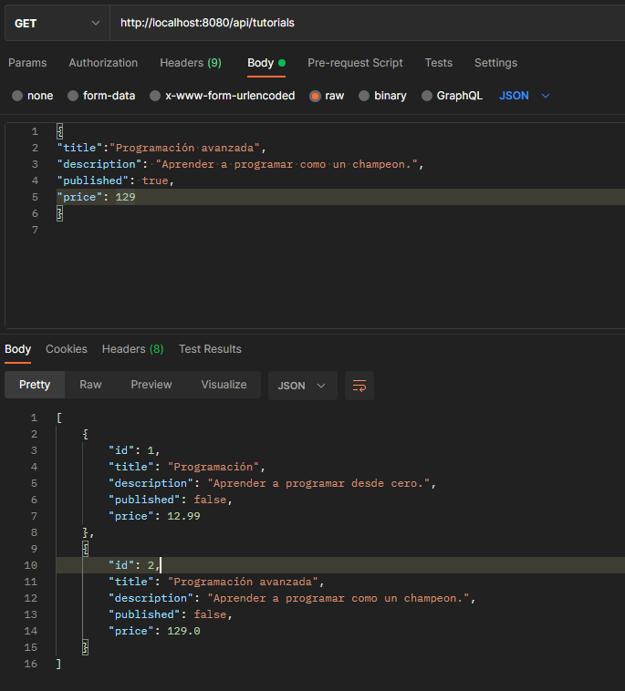
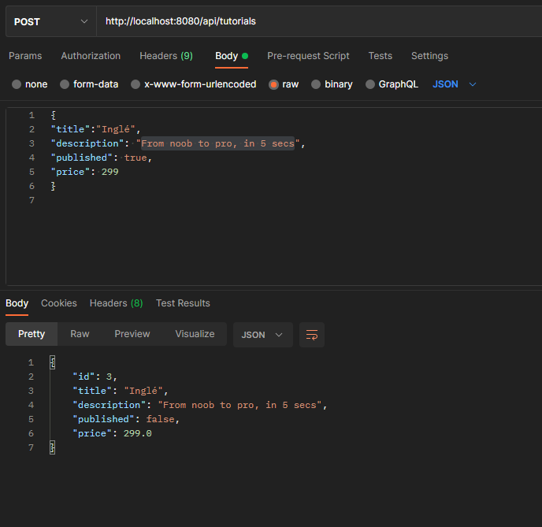
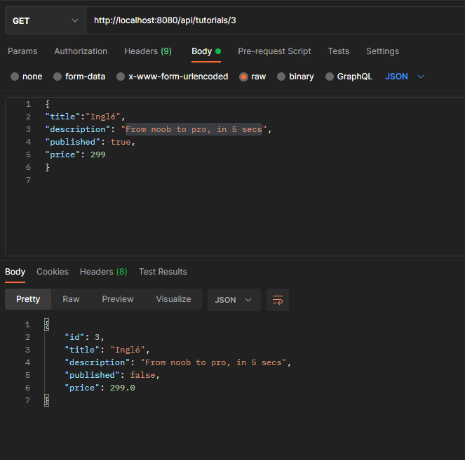
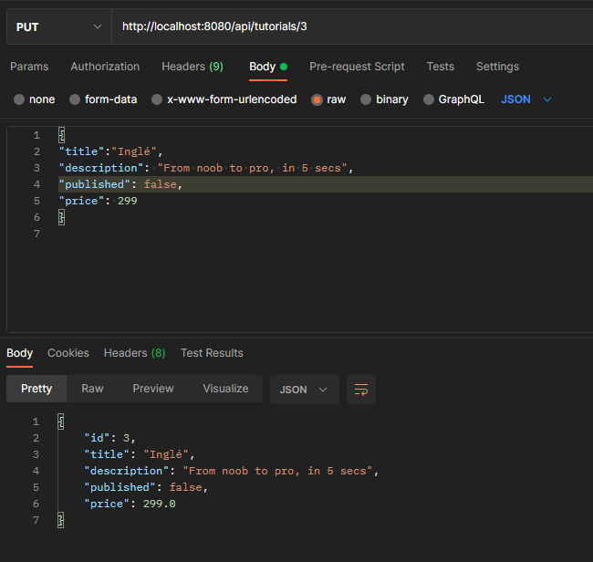
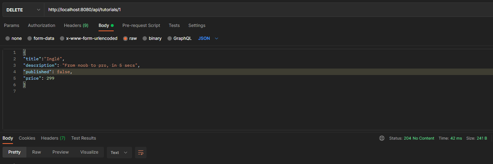
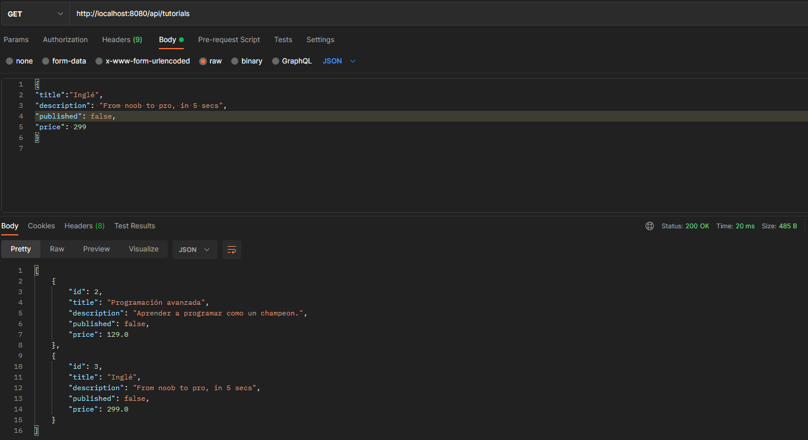

# Spring Boot JPA MySQL - Building Rest CRUD API

## API REST

Listado de funciones realizadas

- Obtener listado de tutoriales
- Agregar un nuevo tutorial
- Buscar tutorial por ID
- Modificar un tutorial con el ID
- Eliminar un tutorial con el ID

### Obtener listado de tutoriales
`GET /tutorials`

----

### Agregar un nuevo tutorial
`POST /tutorials`

----

### Buscar tutorial por el ID
`GET /tutorials/{id}`

----

### Modificar un tutorial con el ID
`PUT /tutorials/{id}`

----
### Eliminar un tutorial con el ID
`DELETE /tutorials/{id}`

